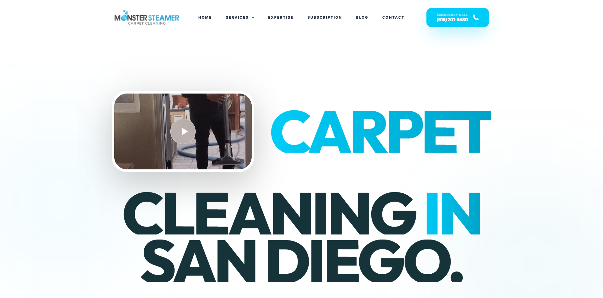
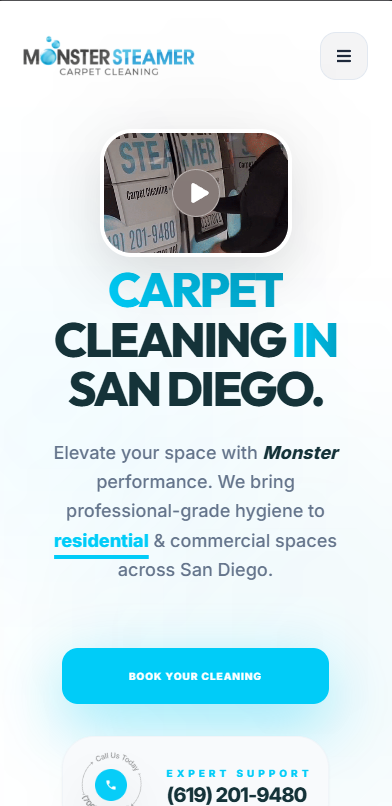

<div align="center">

# 🌊 Monster Steamer
### **Premium Carpet Cleaning & Professional Hygiene in San Diego**

[](https://reactjs.org/)
[](https://vitejs.dev/)
[](https://tailwindcss.com/)
[](https://greensock.com/gsap/)
[](https://www.framer.com/motion/)

[**Live Demo**](https://monster-steamer-inky.vercel.app/)

</div>

---

## 📸 Project Preview

<div align="center">
  
  <br>
  <em>Premium Landing Page for San Diego's Leading Carpet Cleaning Service</em>
</div>

<div align="center">
  
</div>

---

## 🚀 Project Overview

**Monster Steamer** is a high-performance, visually stunning landing page built for a premium carpet cleaning service based in San Diego. It isn't just a website; it's a digital experience designed to mirror the professional-grade hygiene and "Monster" performance provided by the brand.

Built with a focus on **Visual Excellence** and **Interactive Motion**, the project leverages cutting-edge frontend technologies to create a seamless, premium feel that builds immediate trust with residential and commercial clients.

### 🎯 Who is it for?
- **San Diego Residents** seeking professional-grade carpet hygiene.
- **Commercial Property Managers** requiring reliable, large-scale cleaning services.
- **Developers** looking for a reference implementation of GSAP + Framer Motion in a React environment.

---

## 💎 Why This Project Matters

Most service-based websites are generic and static. **Monster Steamer** breaks that mold by treating a service business with the same level of design sophistication as a high-end tech product.

- **Engineering Excellence**: Seamlessly integrates `GSAP` for complex timeline animations and `Framer Motion` for reactive UI transitions.
- **User-Centric Motion**: Implements 3D tilt effects and smooth scrolling (`Lenis`) to increase session duration and brand engagement.
- **Product-Grade Quality**: Optimized for high-performance rendering, ensuring that heavy animations don't compromise the user experience.

---

## 🛠️ Tech Stack

| Category | Technology | Usage |
| :--- | :--- | :--- |
| **Frontend** | [React](https://react.dev/) | Component-based UI architecture. |
| **Build Tool** | [Vite](https://vitejs.dev/) | Next-generation frontend tooling for fast development. |
| **Styling** | [Tailwind CSS](https://tailwindcss.com/) | Utility-first styling for rapid, responsive design. |
| **Animations** | [GSAP](https://greensock.com/gsap/) | High-performance timeline-based animations. |
| **Motion** | [Framer Motion](https://www.framer.com/motion/) | Declarative animations and reactive gesture handling. |
| **Smooth Scroll** | [Lenis](https://lenis.darkroom.engineering/) | Robust, high-performance smooth scrolling experience. |
| **Icons** | [React Icons](https://react-icons.github.io/react-icons/) | Centralized icon management. |
| **Routing** | [React Router](https://reactrouter.com/) | Client-side navigation (SPAs). |

---

## 🏗️ System Architecture & Workflow

The application follows a **Modular Component Architecture**, ensuring that every section of the landing page is isolated, reusable, and easy to maintain.

### 🔄 Internal Workflow
1. **Request Lifecycle**: Requests enter through a optimized `Vite` dev/build pipeline.
2. **Smooth Scroll Layer**: The entire `Home` page is wrapped in a `SmoothScroll` component (Lenis), decoupling the scroll physics from the browser default for a "liquid" feel.
3. **Animation Orchestration**:
   - **Entry Animations**: GSAP handles the initial hero text reveals and timeline-based triggers.
   - **Reactive Interactivity**: Framer Motion handles mouse-tracking 3D tilts and button hover states.
4. **Data Management**: State is managed via React Hooks (`useState`, `useRef`) for animation triggers and UI interactions.

---

## 📡 API & Data Flow

While currently a high-fidelity frontend, the architecture is designed to integrate seamlessly with inquiry and booking APIs.

### 📅 Booking Data Flow
1. **User Action**: Client clicks "Book Your Cleaning".
2. **Validation**: Frontend validates inputs via local state or schema validation.
3. **Service Layer**: An asynchronous service call is triggered to the backend/inquiry service.
4. **User Feedback**: Dynamic success/error states are rendered using Framer Motion alerts.

| Method | Endpoint | Purpose |
| :--- | :--- | :--- |
| `POST` | `/api/v1/book` | Submits a cleaning request to the admin dashboard. |
| `GET` | `/api/v1/services` | Fetches dynamic service pricing and descriptions. |

---

## ✨ Key Features

### 🌟 User Experience
- **Interactive 3D Video Hero**: A unique transition where the hero video morphs into a feature element upon interaction.
- **Smooth Scroll (Lenis)**: High-performance scrolling that feels premium across all devices.
- **3D Tilt Elements**: Reactive mouse-tracking on featured images for a depth-filled experience.

### 🔒 Reliability
- **Responsive Fluidity**: Pixel-perfect layout from 4K monitors down to mobile screens.
- **Performance Optimized**: Assets are optimized for fast LCP (Largest Contentful Paint).

### 🛠️ Developer Experience
- **Strict Linting**: ESLint + Prettier configuration for consistent code quality.
- **Modular Components**: Clean separation between Logic and View layers.

---

## 📦 Folder Structure

```bash
src/
 ┣ assets/       # Optimized images, videos, and icons
 ┣ components/   # Reusable UI components (Hero, Navbar, etc.)
 ┃ ┣ icon/       # SVG components with PropTypes validation
 ┃ ┗ index.js    # Centralized component exports
 ┣ hooks/        # Custom React hooks for animations/logic
 ┣ pages/        # Main page layouts (Home.jsx)
 ┣ styles/       # Global CSS and Tailwind configurations
 ┣ App.jsx       # Root component and Routing
 ┗ main.jsx      # Entry point
```

---

## ⚙️ Installation & Local Setup

### 📋 Prerequisites
- **Node.js** (v18.0.0 or higher)
- **npm** or **pnpm**

### 🚀 Setup Steps

1. **Clone the Repository**
   ```bash
   git clone https://github.com/ArnabSaga/Monster-Steamer.git
   cd Monster-Steamer
   ```

2. **Install Dependencies**
   ```bash
   npm install
   ```

3. **Configure Environment**
   Create a `.env` file in the root directory:
   ```env
   VITE_APP_TITLE=Monster Steamer
   VITE_CONTACT_PHONE=(619) 201-9480
   ```

4. **Start Development Server**
   ```bash
   npm run dev
   ```

---

## 📄 License

Distributed under the **MIT License**. See `LICENSE` for more information.

---

<div align="center">
  <p>Built with ❤️ for the San Diego Community</p>
  <p>© 2026 Monster Steamer. All Rights Reserved.</p>
</div>
